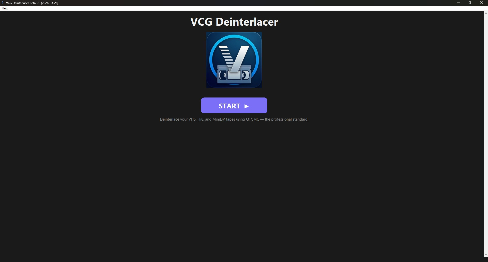
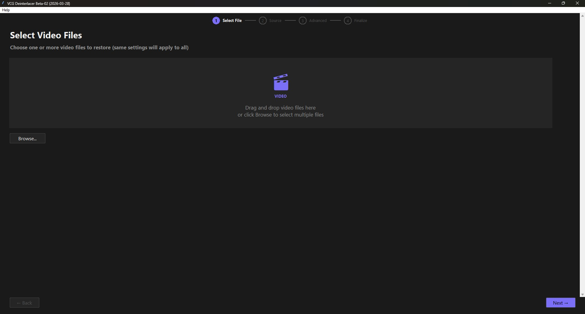
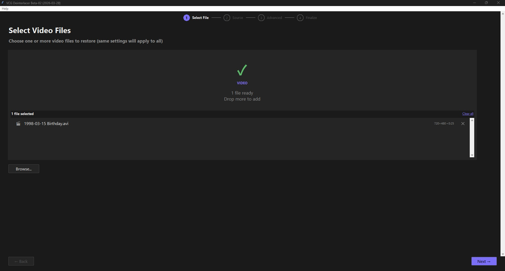
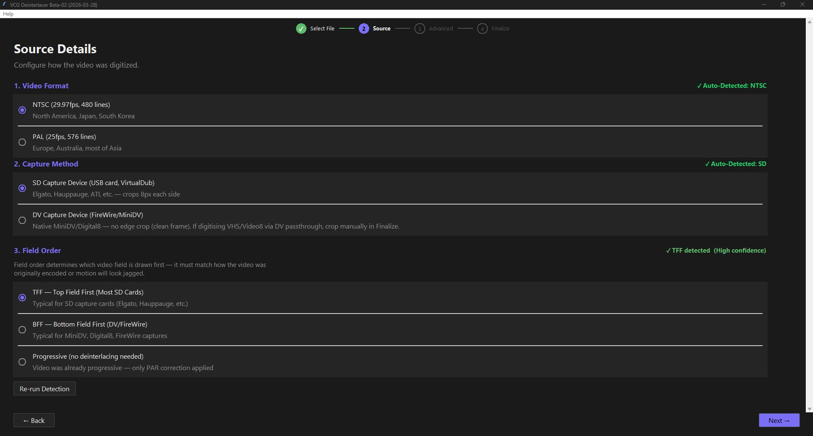
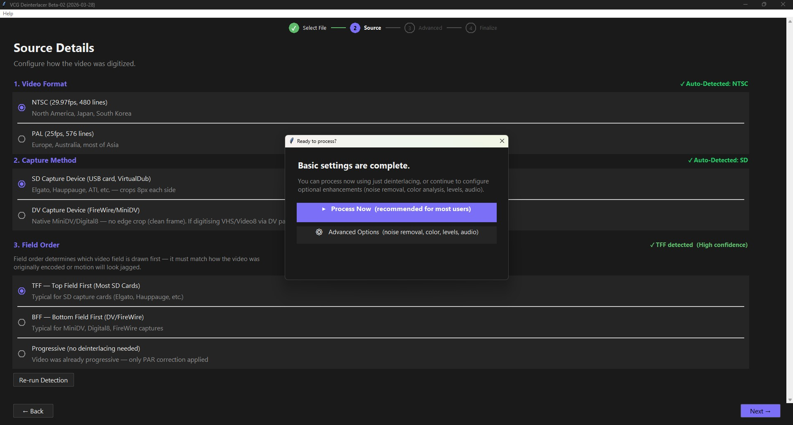
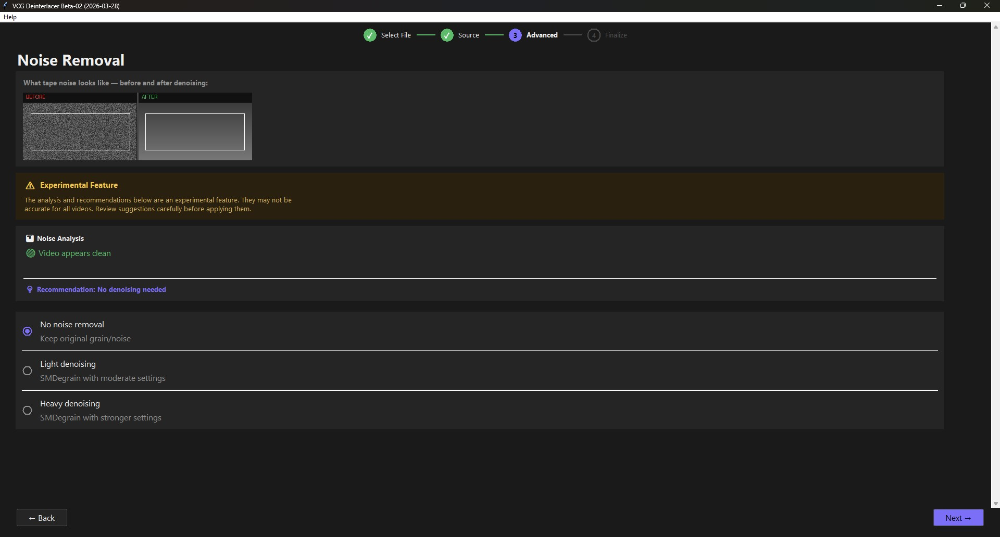
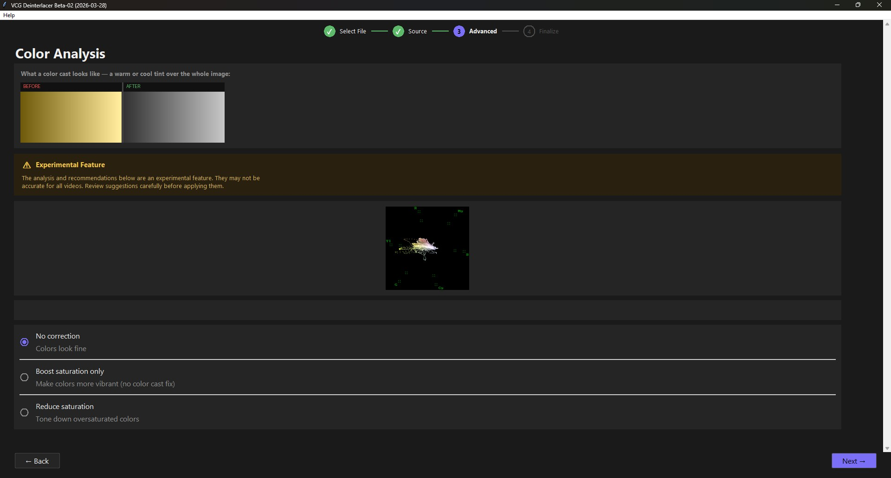
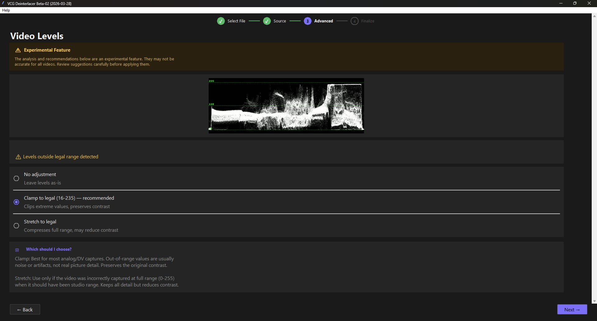
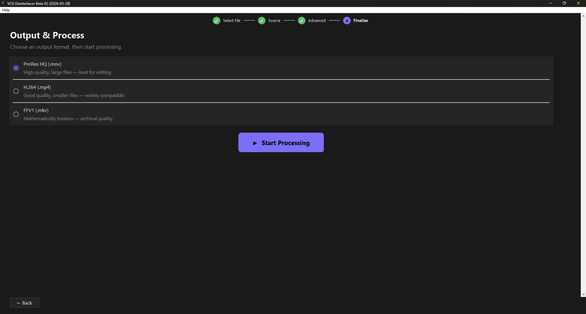
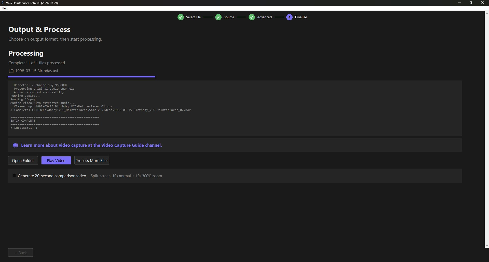

# VCG Deinterlacer
by [VideoCaptureGuide](https://www.VideoCaptureGuide.com)

A free Windows tool for deinterlacing VHS, Hi8, Video8, and MiniDV tape captures using **QTGMC** — the industry-standard motion-compensated deinterlacer. Guided step-by-step wizard interface with automatic video analysis.

---

## Download

**[Download VCG_Deinterlacer](https://github.com/Video-Capture-Guide/VCG-Deinterlacer/releases/latest)**

Double-click `VCG_Deinterlacer.exe`. On first launch, the app automatically downloads and installs FFmpeg and VapourSynth — no manual setup required.

---

## Features

- **QTGMC deinterlacing** — the gold standard for analog video restoration
- **Automatic first-run setup** — downloads FFmpeg and VapourSynth automatically on first launch
- **Automatic video analysis** — detects noise level, color cast, color bleeding, and levels
- **Guided wizard** — walks you through every setting with explanations
- **Batch processing** — queue multiple files and process them overnight
- **Multiple output formats** — ProRes HQ, H.264, FFV1 (lossless), and more
- **PAR correction** — automatically converts non-square pixels to square for NTSC and PAL
- **Temporal denoising** — optional SMDegrain for noisy VHS footage
- **Upscaling** — optional upscale to presets with NNEDI3
- **Mono-to-stereo** — optional fix if your video has audio in only one channel
- **Color correction** — auto-detects and corrects color casts and saturation issues
- **Comparison video** — generates a side-by-side original vs. enhanced clip
- **Drag and drop** — drop video files directly onto the app window
- **Portable** — no installer, no UAC prompt, no admin rights required

---

## Screenshots

<table>
<tr>
<td align="center"><br><sub>Welcome screen</sub></td>
<td align="center"><br><sub>Step 1 — Select video files</sub></td>
</tr>
<tr>
<td align="center"><br><sub>Step 1 — File loaded and ready</sub></td>
<td align="center"><br><sub>Step 2 — Source details (auto-detected)</sub></td>
</tr>
<tr>
<td align="center"><br><sub>Step 2 — Quick-process option</sub></td>
<td align="center"><br><sub>Step 3 — Noise removal analysis</sub></td>
</tr>
<tr>
<td align="center"><br><sub>Step 3 — Color analysis</sub></td>
<td align="center"><br><sub>Step 3 — Video levels</sub></td>
</tr>
<tr>
<td align="center"><br><sub>Step 4 — Choose output format</sub></td>
<td align="center"><br><sub>Step 4 — Processing complete</sub></td>
</tr>
</table>

---

## System Requirements

- **Windows 10 or 11** (64-bit)
- **Internet connection** on first launch (to download FFmpeg and VapourSynth, ~136 MB)

FFmpeg and VapourSynth are downloaded automatically into a `_deps\` folder next to the EXE. No system-wide installation is required.

---

## Installation

1. Download `VCG_Deinterlacer_Beta-02.zip` from the [Releases page](https://github.com/Video-Capture-Guide/VCG-Deinterlacer/releases/latest)
2. Extract the ZIP to any folder (e.g. `C:\Tools\VCG_Deinterlacer\`)
3. Double-click `VCG_Deinterlacer.exe`
4. On first launch, the **First Run Setup** window appears and downloads the required tools (~136 MB). This only happens once.
5. After setup completes, the main wizard opens automatically.

On all future launches the wizard opens directly with no setup step.

---

## Usage

1. Launch **VCG Deinterlacer** from the folder where you extracted it
2. Click **START** on the welcome screen
3. **Select File** — drag and drop or browse for your video file(s)
4. **Source** — confirm format (NTSC/PAL), field order (TFF/BFF), and crop settings
5. **Noise** — review the automatic noise analysis and choose a denoising level
6. **Color Bleeding** — review chroma bleed analysis and enable correction if needed
7. **Color Cast** — review color balance and apply correction if needed
8. **Levels** — review luma levels and apply adjustment if needed
9. **Audio** — choose mono-to-stereo mix options if applicable
10. **Finalize** — choose output format, review all settings, and click **Process**

Processing time depends on video length and your CPU. A one-hour VHS capture typically takes 2–4 hours.

---

## Output Formats

| Format | Extension | Best For |
|--------|-----------|----------|
| ProRes HQ | .mov | Editing in DaVinci Resolve, Premiere, Final Cut |
| H.264 | .mp4 | Sharing, uploading to YouTube |
| FFV1 | .mkv | Archiving (lossless) |
| DNxHD 115 | .mov | Editing in Avid |

---

## Field Order Reference

| Source Format | Field Order |
|---------------|-------------|
| VHS (most decks) | TFF (Top Field First) |
| S-VHS | TFF |
| Video8 / Hi8 | TFF |
| MiniDV / Digital8 | BFF (Bottom Field First) |
| Betacam | TFF |

If motion looks jerky or stuttery after processing, try switching the field order.

---

## Troubleshooting

**First Run Setup fails to download**
- Check your internet connection
- Try disabling your VPN or firewall temporarily
- You can download the tools manually — see the instructions shown in the setup window

**The app opens but processing fails immediately**
- Delete the `_deps\` folder next to the EXE and re-launch to re-run the setup
- Check that `_deps\ffmpeg\ffmpeg.exe` and `_deps\vs\vspipe.exe` exist

**"Could not load source" error**
- Make sure `_deps\vs\plugins64\LSMASHSource.dll` exists
- Try re-running the setup by deleting the `_deps\` folder

**Processing is very slow**
- QTGMC is CPU-intensive — this is normal
- Close other applications to free up CPU
- Consider reducing the denoising level if enabled

**Output video has wrong aspect ratio**
- Enable PAR correction in the Source step
- Make sure the correct format (NTSC/PAL) is selected

**Audio is missing from output**
- Check the Audio step — ensure the correct audio option is selected
- Verify the source file has an audio track using MediaInfo

---

## Technical Details

VCG Deinterlacer uses a conservative QTGMC configuration designed to preserve the original analog character without over-processing:

```
Sharpness=0.1    (very mild — most presets use 0.2–1.0)
Lossless=2       (preserves original pixels where no MC is needed)
SourceMatch=3    (highest quality source matching)
NoiseProcess=2   (temporal denoise within QTGMC)
```

Full QTGMC parameter details are available in the app under **Help → About VCG Deinterlacer**.

---

## Building from Source

See [BUILD_INSTRUCTIONS.md](BUILD_INSTRUCTIONS.md) for full build instructions.

**Quick start:**
```
pip install -r requirements.txt
build_vcg_deinterlacer.bat
```

Requires Python 3.10+, Visual Studio Build Tools (or MinGW64).

---

## License

MIT License — see `LICENSE.txt` for full terms.

This software is free and open source. Third-party components (FFmpeg, VapourSynth, havsfunc) are subject to their own licenses.

---

## Version History

| Version | Date | Notes |
|---------|------|-------|
| v1.0.4  | 2026-04-19 | Release: Python 3.13+ VSScript fallback; manual crop mod-2 width/height auto-correction |
| Beta-03b | 2026-04-19 | Fix odd-width crash from manual crop (YUV422 mod-2 width constraint) |
| Beta-03a | 2026-04-19 | Fix odd-height crash from manual crop (SeparateFields mod-2 height constraint) |
| Beta-03  | 2026-04-18 | Python 3.13+ compatibility via bundled vapoursynth.pyd, bypassing VSScript |
| Beta-02b | 2026-04-05 | Fix RGB source support; faster launch via persistent cache dir |
| Beta-02 | 2026-03-28 | Portable ZIP; first-run auto-setup; no installer |
| Beta-01 | 2026-03-23 | Inno Setup installer; manual FFmpeg/VapourSynth install |
| Beta 0.4 | 2026-03-17 | First working installer build |
| Beta 0.2 | 2026-03-09 | Initial release |

---

## About

**VCG Deinterlacer** is developed by [VideoCaptureGuide](https://www.youtube.com/@VideoCaptureGuide) — a YouTube channel dedicated to VHS capture, tape preservation, equipment reviews, and analog video restoration tutorials.

Subscribe for tutorials on getting the most out of your tape archive.

- YouTube: https://www.youtube.com/@VideoCaptureGuide
